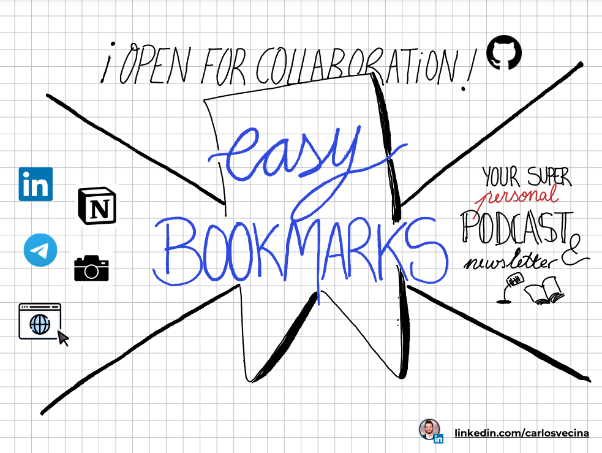

# Easy Bookmarks 🔖🤖

FOMO bookmark mess is over! Now, you can easily centralize and manage your bookmarks with AI.

Then, **create your personal Newsletter or Podcast** with the latest bookmarks and scrapped content you've added.

## Overview

Easy Bookmarks aims to help you integrate, centralize, and digest bookmarks spread across various apps in one place using AI. With Easy Bookmarks, you no longer have to worry about losing track of your saved links or struggling to find them later. AI will help you digest all your bookmarks and make it easier to find what you need.

## Features

- **Integrations**: Seamlessly integrates with multiple apps and websites to gather all your bookmarks in one place.
- **Centralization**: Centralizes your bookmarks, making it easier to manage and access them.
- **Generative AI digest**: Shall you a Newsletter or a Podcast? Configure Easy Bookmarks to periodically create a newsletter with the latest bookmarks you added.

## Getting Started

TBD

## Contributing

This is a personal project but aiming to help other people! In this early stage, if you'd like to contribute to Easy Bookmarks, please get in contact [with me here.](https://linkedin.com/in/carlosvecina/)
